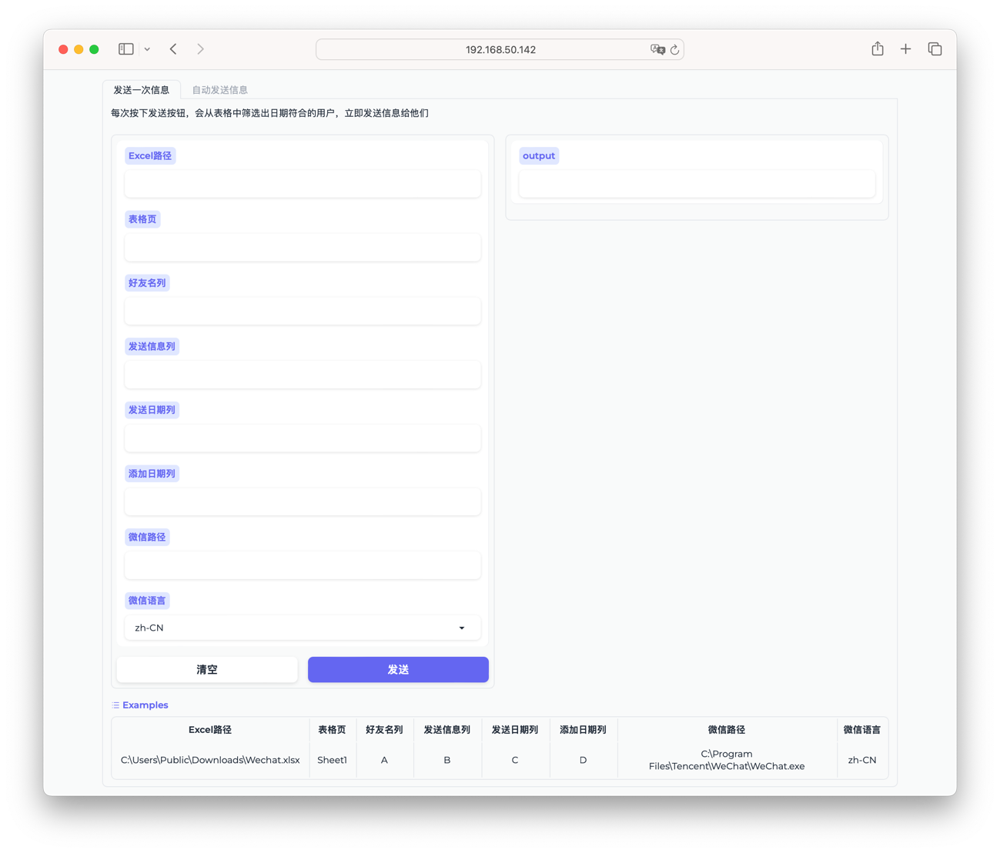
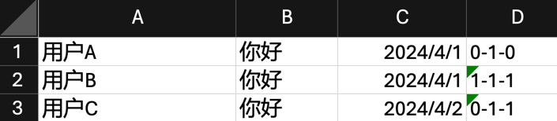

<h1 align="center"> 🌧️YuYuWechat</h1>

一个让微信定期自动发送消息，定期循环重复发送消息，群发消息的小工具🚀

## 1. 介绍
本人的工作涉及定期给微信好友发送消息，无奈手动发送实在太累了还容易出错，因此做了这个小工具🛠️，
并用之前折腾AI的三脚猫功夫做了一个前端（Gradio）方便使用🎨

## 2. 运行
### 直接运行编译好的exe文件（推荐）💾
在 [Releases](https://github.com/xieyumc/YuYuWechat/releases) 界面下载最新编译好的exe文件，双击运行👆
### 从源码运行💻
安装依赖
```shell
pip install -r requirements.txt
```
运行
```shell
python GradioMain.py
```


## 3.详细介绍
### Excel表格📊

管理发送消息需要一个Excel文件，需要4列信息：
1. `接收人`
2. `消息内容`
3. `发送日期`
4. `循环日期`

如下图所示：
   

`接收人`：可以是微信好友的备注名或者微信号，只要在搜索结果中排名第一

`消息内容`：要发送的消息  

`发送日期`：消息发送的日期，**此列需要在Excel中设置为日期格式**  

`循环日期`：消息循环发送的增量，**此列需要在Excel中设置为文本格式，格式为年-月-日**  
如`0-0-1`表示每天发送一次，`0-1-0`表示每月发送一次

### 运行原理
程序开始运行，会从表格中`发送日期`列筛选日期为今天的用户，然后发送对应的消息  

发送消息后，会给`发送日期`加上`循环日期`，实现循环发送日期，   

例如今天是`2024/4/1`，符合日期条件的有`用户A`和`用户B`，  
给`用户A`发送消息后，会把`发送日期`增加一个月，变成`2024/5/1`，  
给`用户B`发送消息后，会把`发送日期`增加一年一月一天，变成`2025/5/2`，  
这样就实现了循环发送消息的功能

自动发送信息则是在以上基础上，每分钟检查一次时间，到达`发送时间`则发送消息


## 4.运行步骤
打开程序，会自动打开浏览器🌐，  

选择仅`发送一次消息`，或者设置`自动发送消息`⏲️，  

按照提示填好信息，我在网页最下面写好了一个`示例`📝，可直接点击应用或根据实际情况填写，  

点击`发送`按钮，即可发送消息✅
> 注意事项：发送消息时不要操作键盘鼠标，不然可能导致发送失败  
>在`自动发送消息`中的`发送时间`格式为HH:MM，如`08:00`，`18:00`，`23:59`等


## 5.每个文件详细作用
- `GradioMain.py`：主程序，运行此文件即可打开前端🖥️
- `GradioMain.spec`：Pyinstaller编译配置文件，可以直接运行`pyinstaller GradioMain.spec`编译🔧
- `AutoSendMessage.py`：自动发送消息定时器⏲️
- `AutoWechat.py`：微信自动化各种操作🤖
- `ProcessedExcel.py`：处理Excel表格，读取数据等📑
- `SendMessageOnce.py`：发送消息的主要逻辑💬
- `WechatLocale.py`：微信语言映射🌐

## 6.感谢
感谢以下项目的启发和帮助

[easyChat](https://github.com/LTEnjoy/easyChat)

[wxauto](https://github.com/cluic/wxauto)

[uiautomation](https://github.com/yinkaisheng/Python-UIAutomation-for-Windows)

[Gradio](https://www.gradio.app)

如果这个小工具正好对你有帮助，欢迎点个star⭐，谢谢！

有问题欢迎提issue，我会尽快回复📬

有更多需求或者想要更多功能，也欢迎提issue，我会尽量满足大家的需求📈


