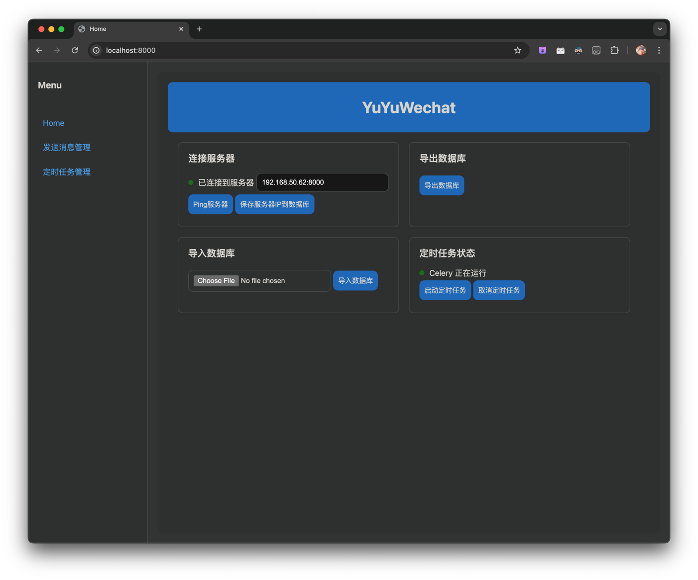
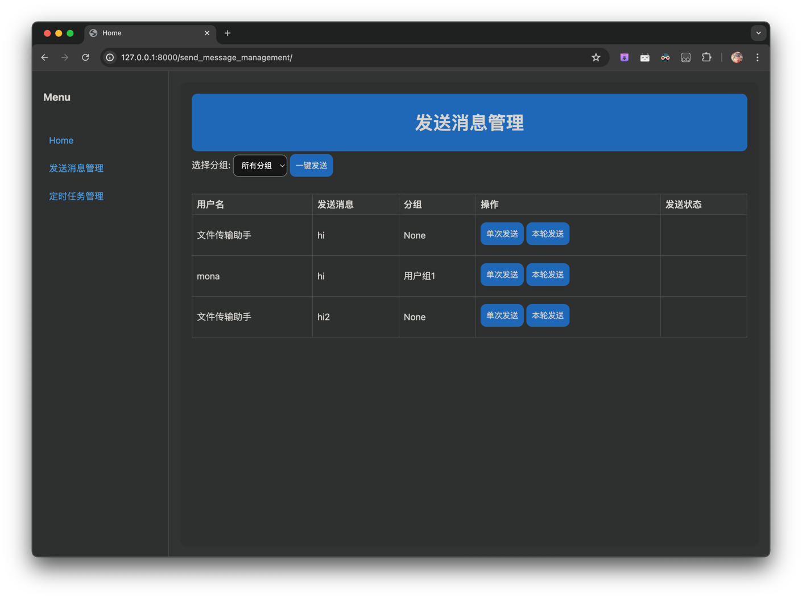
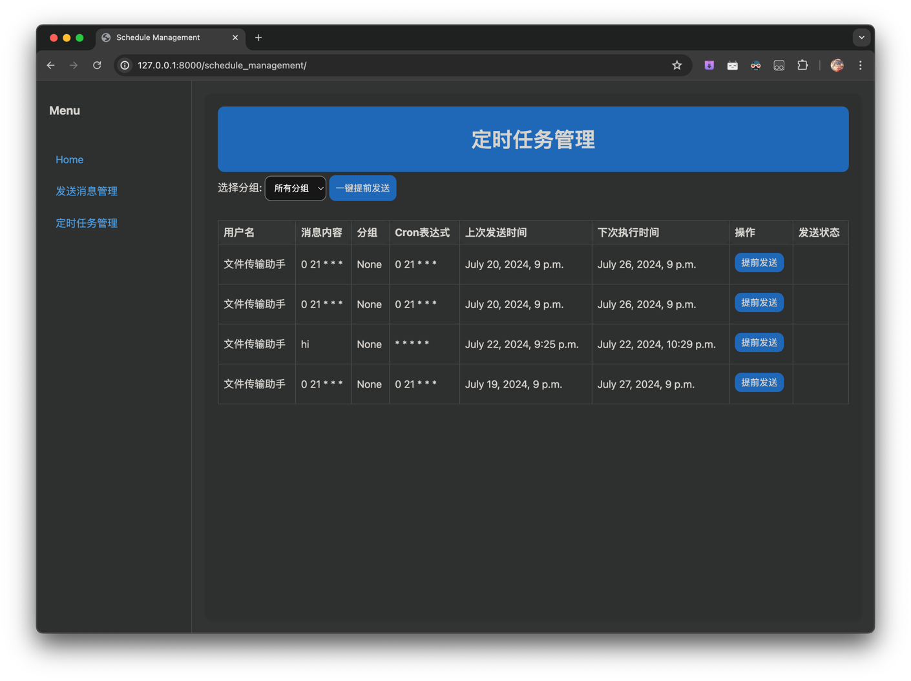
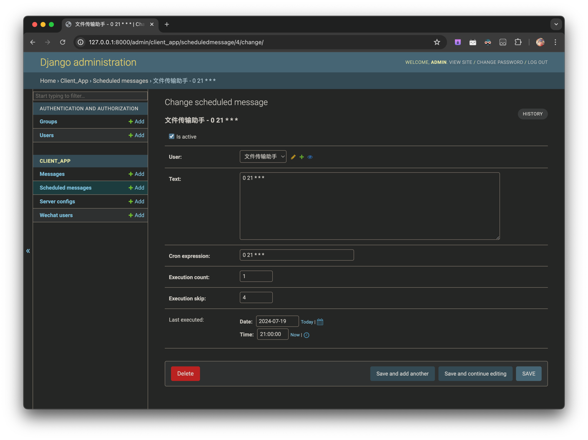
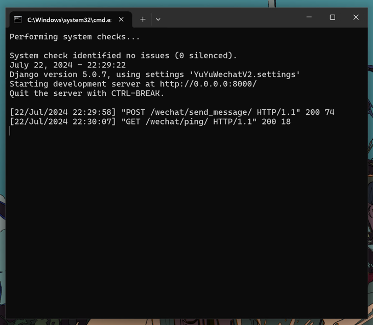
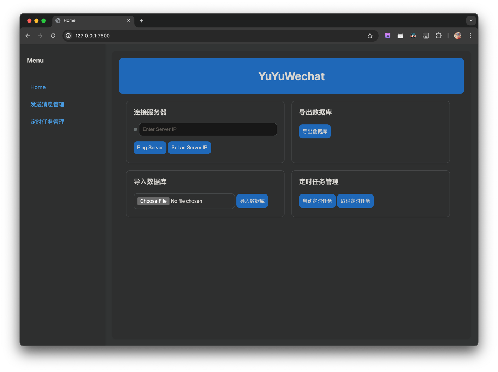
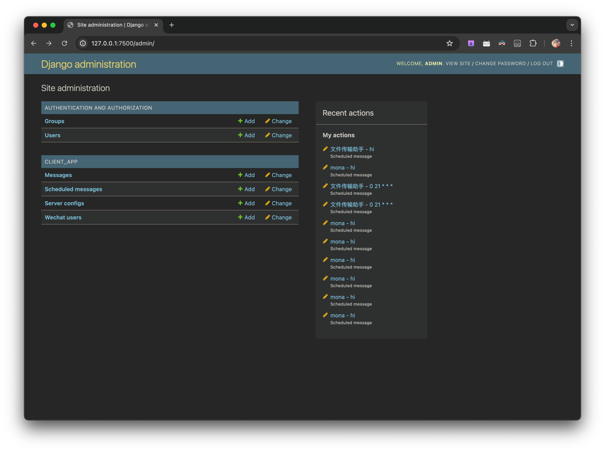
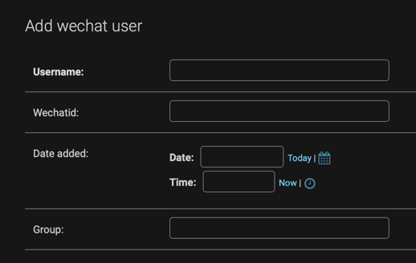
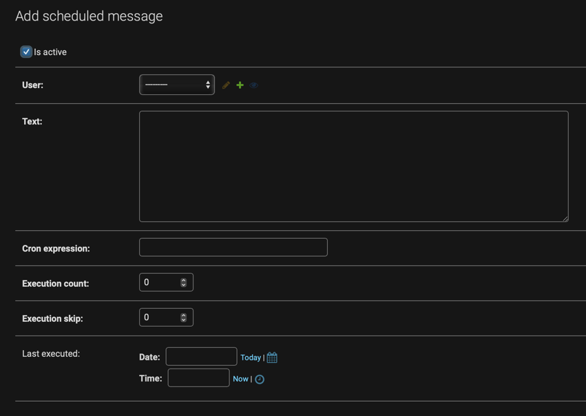

<h1 align="center"> 🌧️YuYuWechat</h1>

一个让微信批量发送消息，定时自动发送消息的小工具🚀


<h6 align="center">首页管理界面


<h6 align="center">批量发送消息


<h6 align="center">定时发送消息


<h6 align="center">后台管理界面

# ✨功能特点

✅自动发送消息：自动检查时间并在对应时刻发送消息🤖（基于cron表达式，可精确到分钟）

✅循环发送消息：cron表达式可设置任意循环作业🔄

✅群发消息：一次性向多个好友发送不同的消息👥

✅全平台支持，轻松部署在服务器上，服务端部署在win平台接受客户端的请求，客户端可部署到任意平台🌍

# 1. 介绍

本项目分为2部分，服务端和客户端：

## YuYuWechatV2_Server服务端

  

服务端是一个轻量的服务器，和微信一起安装在win上，接受客户端的网络请求并对微信进行自动化操作

### 服务端接受两个请求：

- `/ping`：检查服务端是否正常运行，返回`'status': 'pong'`
- `/send_message/`：发送消息，接受json格式的数据`name`、`text`，并对微信进行自动化操作

### 并发保证

服务端有消息队列和互斥锁，只需要把消息发送给服务端，服务端会自动处理消息队列，保证消息依次发送

## YuYuWechatV2_Client客户端


客户端是一个轻量的前端，可以在任意平台上运行，通过网络请求发送消息给服务端

### 客户端功能

- `首页`：连接服务器ip，导入导出数据库，启动定时任务
- `发送消息管理`：批量发送消息
- `定时任务管理`：定时发送消息
- `数据管理界面`：管理数据库内容，编辑发送消息

# 2. 运行服务端

**为了简化服务端配置，请把微信安装在`C:/Program Files/Tencent/WeChat/WeChat.exe`，这个位置是默认的微信安装位置，如果你微信安装在其他地方，请创建一个快捷方式在这里**

## 使用编译后EXE直接运行（推荐）

- 在release界面找到最新的版本，下载`YuYuWechatV2_Server.exe`和`YuYuWechatV2_Server_run.bat`

- 两个文件放在同一个目录下，双击`YuYuWechatV2_Server_run.bat`即可运行

###### ⚠️Windows的bug，有的时候若是打开bat没反应，需要在控制台（小黑黑窗口那个）按一下回车

## 使用源码运行

- cd到`YuYuWechatV2_Server`目录下

- 安装依赖`pip install -r requirements.txt`

- 运行`python manage.py runserver 0.0.0.0:8000`

## 测试服务端是否正常运行

上一步安装并运行服务端后，可以用简单的命令测试服务端是否成功运行

打开终端（powershell）：

### 测试服务端是否正常启动

```shell
curl http://127.0.0.1:8000/wechat/ping
```

正常会返回

```shell
StatusCode        : 200
StatusDescription : OK
Content           : {"status": "pong"}
RawContent        : HTTP/1.1 200 OK
                    Vary: origin
                    X-Frame-Options: DENY
                    X-Content-Type-Options: nosniff
                    Referrer-Policy: same-origin
                    Cross-Origin-Opener-Policy: same-origin
                    Content-Length: 18
                    Content-Type: applicat...
Forms             : {}
Headers           : {[Vary, origin], [X-Frame-Options, DENY], [X-Content-Type-Options, nosniff], [Referrer-Policy, same
                    -origin]...}
Images            : {}
InputFields       : {}
Links             : {}
Links             : {}                                                                                                  ParsedHtml        : System.__ComObject                                                                                  RawContentLength  : 18
```

### 测试自动化功能

```shell
$jsonData = '{"name": "文件传输助手", "text": "hi"}'
Invoke-WebRequest -Uri http://127.0.0.1:8000/wechat/send_message/ -Method Post -Headers @{"Content-Type"="application/json"} -Body $jsonData -ContentType "application/json; charset=utf-8"
```
这个命令会给文件传输助手发送一条消息hi

# 3.运行客户端
## 使用docker运行（推荐）
我已经编译好了x86和arm的docker镜像，Windows/mac/Linux的x86和arm架构均可运行

- 在release界面找到最新的版本，下载`docker-compose.yml`文件
- 运行`docker-compose up`即可运行

###### 这个docker文件会拉取两个镜像，一个是`mona233/yuyuwechatv2_client:latest`，另一个是`redis:latest`，因为定时任务的celery需要一个消息队列，我默认使用redis，端口为6379
###### 如果你从docker hub拉取镜像有困难，可以在release界面找到最新版本的`yuyuwechatv2_client.tar.gz`，这是编译好的docker镜像，导入本地docker即可

## 从源码运行
如果你想自定义数据库结构和增加功能，可以从源码运行

- cd到`YuYuWechatV2_Client`目录下
- 安装依赖`pip install -r requirements.txt`
- 运行`python manage.py runserver 127.0.0.1:7500`

## 使用编译后EXE直接运行  
### ⚠️⚠️⚠️不推荐，缺少定时功能，请勿用在生产环境


**客户端的定时功能需要celery和redis支持，这两个库编译成exe非常困难，所以exe版本没有定时功能**  

**exe版本由GitHub Action自动编译，虽然源码有单元测试，但是并没有对编译后的exe进行测试，所以不保证可靠性**

- 在release界面找到最新的版本，下载`YuYuWechatV2_Client.exe`和`YuYuWechatV2_Client_run.bat`
- 两个文件放在同一个目录下，双击`YuYuWechatV2_Client_run.bat`即可运行

## 打开客户端

### 在本地浏览器输入`127.0.0.1:7500`即可打开前端首页

- 首先需要连接服务器，输入服务器的ip地址和端口，如`192.168.50.1:8000`，然后点击ping测试服务器是否连通，连通后，点击保存服务器ip即可持久化保存到数据库，下次不需要再配置服务器ip  
- 数据库导入导出功能可以方便备份和还原
- 点击`启动定时任务`，才会启动定时发送任务

其他功能在侧边栏点击即可跳转到对应的界面，前端网页只涉及对数据库的查看和发送操作，对用户和消息内容的增加，删除，修改均需要在后台管理界面进行，这样可以保证数据的安全性


### 在本地浏览器输入`127.0.0.1:7500/admin`，可以进入后台管理界面，  默认用户名`admin`，密码为`admin@django`


在client_app里是客户端的数据，可以看到有4个数据表

- `Messages`：发送消息管理的数据表
- `Scheduled messages`：定时任务管理的数据表
- `Server configs`：服务端配置
- `Wechat users`：微信用户数据表

#### 首先先创建一个微信用户  



- `Username`：微信好友名字或者备注名，必须在搜索结果中排名第一（**必填**）
- `Wechatid`：微信号（**非必填**）
- `Date added`：好友添加日期（**非必填**）
- `Group:`：好友分组，前端网页可以根据分组筛选好友，方便分组管理（**非必填**）

#### 然后再创建消息，这里以定时消息为例


- `Is active`：本条消息是否激活，激活后才会定时发送，默认是激活的
- `User`：选择在上一步增加的微信用户（**必填**）
- `Text`：发送的消息内容（**必填**）
- `Cron expression`：cron表达式，定时发送的时间，格式为`* * * * *`，分别代表`分 时 日 月 周`（**必填**）
- `Execution count:`：消息的执行次数，0为不执行，每次执行后会减一，直到为0，这样可以控制消息的发送次数（**需要手动设置次数**）
- `Execution skip`：消息的跳过次数，默认为0。若设置为1，则下次不会执行任务，下下次才会，若设置为2，则会跳过两次任务，以此类推，这样可以控制定时发送消息的开始（**非必填**）

通过`cron表达式`和`消息的执行次数`和`消息的跳过次数`，即可实现消息的任意时刻开始，结束，在任意时间发送消息，循环发送消息

关于`cron表达式`，本程序是5段式的cron表达式，精确到分钟，请不要和7段式搞混  
网上有在线生成器或者ChatGPT生成也可以
以下是一些例子
```
* * * * *：每分钟执行一次
0 * * * *：每小时执行一次
0 0 * * *：每天执行一次
0 0 * * 1：每周一执行一次


*/10 * * * * # 每10分钟执行一次
0 0 */2 * * # 每隔一天午夜12点执行
0 0 * * 1    # 每周一午夜12点执行
0 0 1 * *    # 每月1日午夜12点执行
0 0 * * 1 [ "$(date +\%d)" -le 7 ]    # 每个月的第一个周一午夜12点执行
```

# 4.可靠性
[](https://codecov.io/github/xieyumc/YuYuWechatV2)

本项目部署了单元测试，GitHub Action测试以及人工测试，最大程度避免bug的产生，但是仍然可能存在未知的bug，如果遇到问题欢迎提issue👏


# 5.感谢

[easyChat](https://github.com/LTEnjoy/easyChat) YuYuWechatV2_Server的核心就是easyChat，请支持它

如果这个小工具正好对你有帮助，欢迎点个star⭐，谢谢！