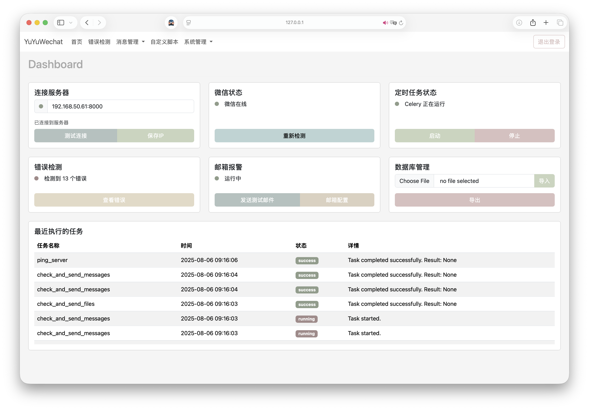
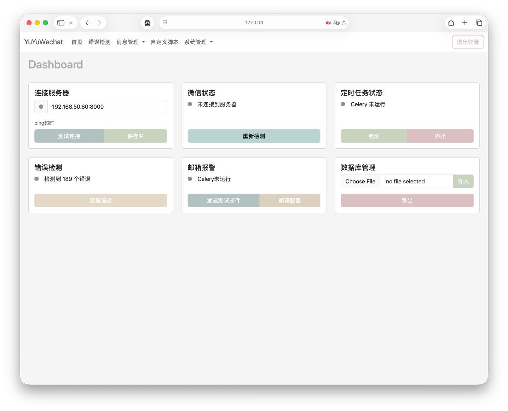
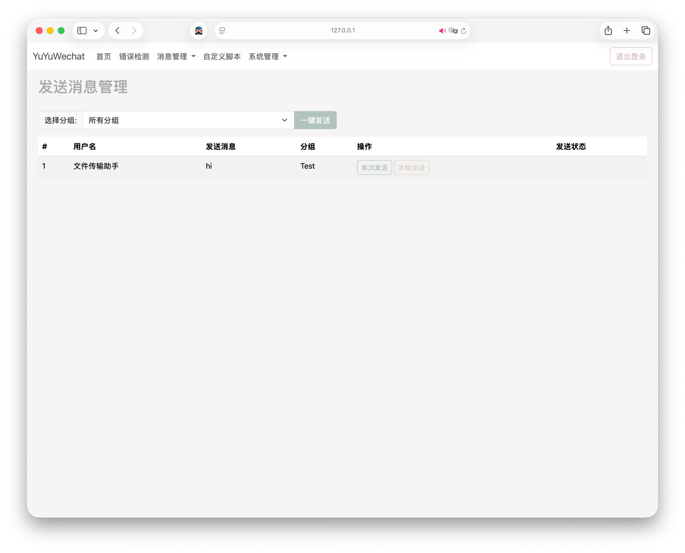
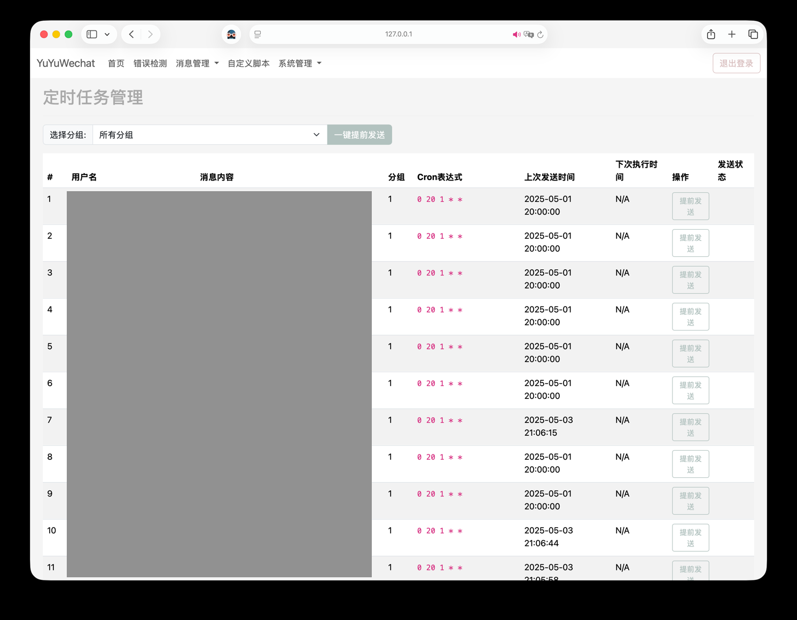
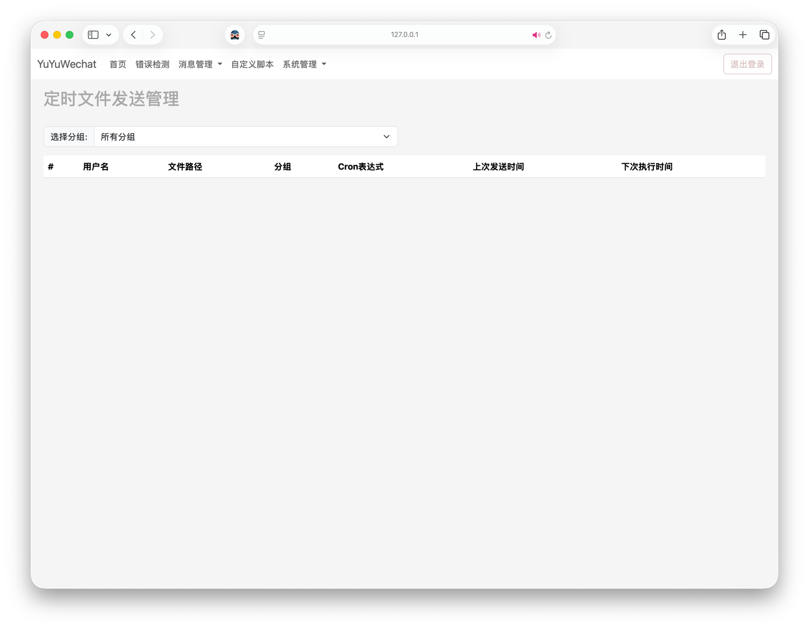
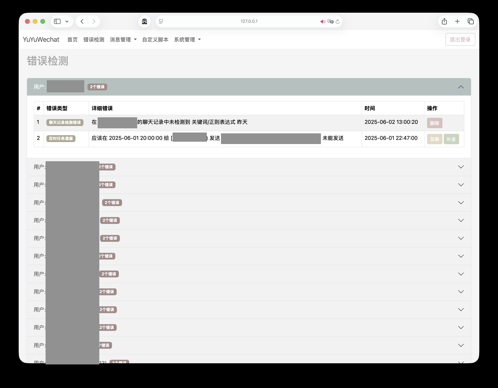
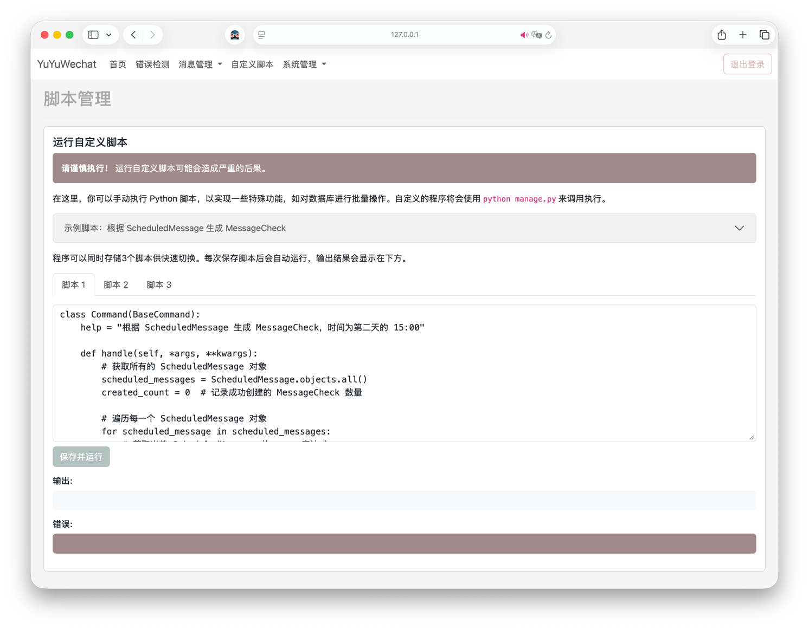
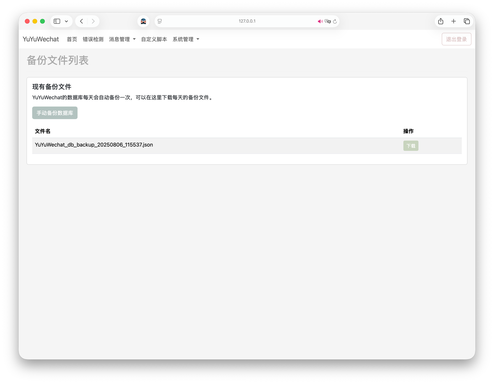
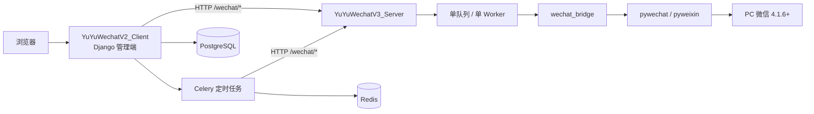

<h1 align="center">YuYuWechat V3</h1>

<p align="center">
  基于 Django、Celery 与 Windows UI Automation 的微信自动化管理工具
</p>

YuYuWechat 用于批量发送消息、定时发送消息和文件、检测聊天记录、记录执行日志并在异常时报警
> V3 当前只支持 Windows 10/11、微信 `4.1.8` 和简体中文界面。需要控制微信 3.x 时，请切换到 `V2` 分支并使用 `YuYuWechatV2_Server`。

## 目录

- [功能概览](#功能概览)
- [系统结构](#系统结构)
- [运行要求](#运行要求)
- [部署 V3 服务端](#部署-v3-服务端)
- [服务端接口](#服务端接口)
- [部署管理客户端](#部署管理客户端)
- [配置自动化任务](#配置自动化任务)
- [自动领取红包和转账](#自动领取红包和转账)
- [日志与可靠性](#日志与可靠性)
- [开发与测试](#开发与测试)
- [常见问题](#常见问题)

## 功能概览

- 批量发送不同文本消息
- 使用五段式 Cron 表达式定时、循环发送消息
- 定时发送服务端本地文件
- 获取聊天记录并按时间分块检测关键词或正则表达式
- 获取聊天中的图片、视频以及临时下载链接
- 置顶或取消置顶指定聊天
- 手动领取红包、收取转账
- 监听未读单聊，自动领取红包和转账，并可发送感谢消息
- 服务端请求串行执行，避免多个请求同时抢占微信窗口
- 客户端任务日志、服务端请求日志、漏执行检测和邮件报警
- Django Admin 数据管理、数据库备份和自定义脚本



















## 系统结构


```mermaid
flowchart LR
    Browser["浏览器"] --> Client["YuYuWechatV2_Client<br/>Django 管理端"]
    Client --> Tasks["Celery 定时任务"]
    Client -->|"HTTP /wechat/*"| Server["YuYuWechatV3_Server"]
    Tasks -->|"HTTP /wechat/*"| Server
    Server --> Queue["单队列 / 单 Worker"]
    Queue --> Bridge["wechat_bridge"]
    Bridge --> Core["pywechat / pyweixin"]
    Core --> Weixin["PC 微信 4.1.6+"]
    Client --> PostgreSQL[(PostgreSQL)]
    Tasks --> Redis[(Redis)]
```

项目分为三个主要部分：

- `YuYuWechatV3_Server`：部署在安装微信的 Windows 电脑上，接收 HTTP 请求并执行微信 UI 自动化。
- `YuYuWechatV2_Client`：管理页面和定时任务中心，可部署在 Windows、macOS 或 Linux。
- `pywechat/pyweixin`：V3 使用的微信 4.x 自动化核心库。源码部署时必须与 V3 服务端保持同仓、同级目录结构。

V3 保留了服务端全局任务队列和互斥锁。即使多个客户端同时连接同一个服务端，微信操作也会按顺序执行。

## 运行要求

### 服务端

- Windows 10 或 Windows 11
- Python 3.10+，推荐 Python 3.11
- PC 微信 `4.1.8`
- 微信界面语言为简体中文，即 `zh-CN`
- Windows 用户已经登录微信
- 桌面保持解锁，运行期间不能进入锁屏或睡眠状态

### 让微信 UI 可被自动化识别

微信 4.x 可能默认隐藏部分 UI Automation 元素。根据 `pywechat/Weixin4.0.md` 的说明，建议首次配置时执行以下操作：

1. 完全退出微信。
2. 在启动微信前打开 Windows 讲述人，可使用 `Win + Ctrl + Enter`。
3. 启动微信并登录，保持讲述人运行约 5 分钟。
4. 关闭讲述人，然后再启动 YuYuWechat V3 服务端。
5. 在 Windows 电源设置中关闭自动睡眠、自动息屏和锁屏。

如果接口提示无法定位微信主窗口，先重复以上流程，而不是修改 UI 定位代码。

## 部署 V3 服务端

### 使用批处理自行编译 EXE（推荐）

V3 建议用户在 Windows 上从 `v3` 分支源码自行编译。仓库已经提供 `YuYuWechatV3_Server/build_pyinstaller_windows.bat`，不需要手动安装和调用 PyInstaller。

编译前确认：

- 已安装 Python 3.10+，推荐 Python 3.11。
- 已完整获取仓库，`pywechat` 和 `YuYuWechatV3_Server` 必须是同级目录。
- 已关闭正在运行的 `YuYuWechatV3_Server.exe`。
- 电脑可以访问 Python 包索引，脚本需要安装构建依赖。

获取源码并编译：

```powershell
git clone -b v3 https://github.com/xieyumc/YuYuWechat.git
cd YuYuWechat\YuYuWechatV3_Server
.\build_pyinstaller_windows.bat
```


> 脚本每次都会删除旧 `dist`。不要直接把生产数据库和日志长期放在源码的 `dist` 目录中；重新编译前请备份 `dist\YuYuWechatV3_Server\db.sqlite3` 和 `logs`，或者把编译结果复制到单独的运行目录。

编译成功后，进入产物目录并初始化：

```powershell
cd dist\YuYuWechatV3_Server
.\YuYuWechatV3_Server.exe migrate
.\YuYuWechatV3_Server.exe createsuperuser
```

> 每次运行服务端前，都必须先完全退出微信，打开 Windows 讲述人，再启动并登录微信。确认微信已经登录后，最后启动 YuYuWechat V3 服务端。不要先登录微信再打开讲述人。

按上述顺序准备完成后，启动服务端：

```powershell
.\YuYuWechatV3_Server.exe
```

不带参数启动时，服务端默认监听 `0.0.0.0:8000`。运行数据保存在 EXE 同目录的 `db.sqlite3`，滚动日志保存在 `logs/server.log`。

> 编译结果采用 PyInstaller 目录模式。部署或备份时必须复制整个 `dist\YuYuWechatV3_Server` 文件夹，不能只复制 EXE，因为程序依赖同目录的 `_internal`。

### 从源码运行

源码目录需要保持如下结构：

```text
YuYuWechat/
├── pywechat/
└── YuYuWechatV3_Server/
```

在 Windows PowerShell 中运行：

```powershell
cd YuYuWechatV3_Server
py -3.11 -m venv .venv
.\.venv\Scripts\Activate.ps1
python -m pip install --upgrade pip
python -m pip install -r requirements.txt
python manage.py migrate
python manage.py createsuperuser
```

> 运行服务端前，必须先完全退出微信，打开 Windows 讲述人，再启动并登录微信。确认微信已经登录后，最后执行服务端启动命令。不要先登录微信再打开讲述人。

```powershell
python manage.py runserver 0.0.0.0:8000 --noreload
```

服务端会自动从仓库根目录的 `pywechat` 加载 `pyweixin`。如果移动了目录，服务端会返回 `pywechat core library not found`。

### 首次配置

启动后访问：

- 服务端首页：`http://127.0.0.1:8000/`
- Django Admin：`http://127.0.0.1:8000/admin/`
- Swagger：`http://127.0.0.1:8000/api/schema/swagger-ui/`
- Redoc：`http://127.0.0.1:8000/api/schema/redoc/`

在 Admin 中打开 `WeChatConfig`。V3 只使用第一条配置记录，各字段含义如下：

| 字段 | 默认值 | 说明 |
| --- | --- | --- |
| `path` | `C:/Program Files/Tencent/Weixin/Weixin.exe` | 微信 4.x 的 `Weixin.exe` 路径；无效时服务端也会尝试自动发现。 |
| `locale` | `zh-CN` | 当前固定为简体中文，其他值无法保存。 |
| `search_pages` | `5` | 在会话列表中滚动查找好友的页数。 |
| `send_delay` | `0.2` | 发送消息或文件时的延迟秒数。 |
| `is_maximize` | `false` | 是否最大化微信；推荐保持关闭。 |
| `window_size` | `1000,1000` | 微信窗口宽高。单栏模式可先尝试宽 600-900、高 700-1200。 |
| `auto_start_wechat` | `true` | 微信未启动时是否尝试自动启动。 |
| `auto_thank_after_red_packet` | `false` | 领取红包或转账后是否自动回复。 |
| `payment_reply_delay` | `2.0` | 领取完成到发送感谢消息之间的延迟秒数。 |
| `auto_payment_check_interval_minutes` | `2.0` | 自动扫描未读消息的间隔分钟数。 |
| `red_packet_thanks_message` | 空 | 自动感谢模板，支持 `{friend}`、`{name}`、`{payment_type}`。 |

服务端首页也提供自动领取状态、启停按钮、感谢消息和微信窗口尺寸配置。首页保存窗口尺寸时会关闭最大化模式，以保持微信单栏布局。

## 服务端接口

旧客户端依赖的接口路径、请求字段和主要响应结构保持兼容。完整字段和在线调试以 Swagger 为准。

| 方法 | 路径 | 请求体或参数 | 用途 |
| --- | --- | --- | --- |
| `GET` | `/wechat/ping/` | 无 | 服务端健康检查，返回 `{"status":"pong"}`。 |
| `POST` | `/wechat/send_message/` | `{"name":"好友","text":"内容"}` | 发送文本消息。 |
| `POST` | `/wechat/send_file/` | `{"name":"好友","file_path":"C:/path/file.pdf"}` | 发送服务端本地文件。 |
| `POST` | `/wechat/check_wechat_status/` | 无 | 检查微信运行、登录和 UI 可访问状态。 |
| `POST` | `/wechat/get_dialogs/` | `{"name":"好友","n_msg":10}` | 获取最近 N 条聊天记录。 |
| `POST` | `/wechat/get_dialogs_by_time_blocks/` | `{"name":"好友","n_time_blocks":3}` | 按时间分块获取聊天记录。 |
| `POST` | `/wechat/get_media_files/` | `{"name":"好友","n_media":5}` | 保存并返回最近图片/视频的临时下载链接。 |
| `GET` | `/wechat/media_cache/<token>/<filename>` | 服务端生成 | 下载媒体缓存文件，缓存默认保留 6 小时。 |
| `POST` | `/wechat/pin_chat/` | `{"name":"好友","pinned":true}` | 置顶或取消置顶聊天。 |
| `POST` | `/wechat/claim_payment/` | `{"name":"好友","reply":"谢谢"}` | 手动领取指定好友的红包/转账；`reply` 可省略。 |
| `GET` | `/wechat/auto_payment_status/` | 无 | 获取自动领取监听状态和累计数量。 |
| `POST` | `/wechat/toggle_auto_payment/` | `{"enabled":true}` | 启用或停止自动领取；不传 `enabled` 时切换状态。 |
| `POST` | `/wechat/run_auto_payment_once/` | 无 | 只扫描一次当前未读单聊。 |
| `POST` | `/wechat/auto_payment_config/` | 自动领取配置 JSON | 更新感谢消息、检查间隔和窗口尺寸。 |
| `GET` | `/wechat/request_logs/?limit=100&offset=0` | 查询参数 | 获取服务端请求日志。 |

聊天记录继续返回兼容旧客户端的三元组结构：

```json
{
  "status": "success",
  "dialogs": [
    ["用户发送", "2026年7月10日 09:30", "你好"],
    ["用户发送图片", "2026年7月10日 09:31", "/wechat/media_cache/.../image.png"]
  ]
}
```

测试服务端连接：

```powershell
Invoke-RestMethod -Uri http://127.0.0.1:8000/wechat/ping/
```

发送消息：

```powershell
$body = @{name = "文件传输助手"; text = "YuYuWechat V3 测试消息"} | ConvertTo-Json
Invoke-RestMethod `
  -Uri http://127.0.0.1:8000/wechat/send_message/ `
  -Method Post `
  -ContentType "application/json; charset=utf-8" `
  -Body $body
```

### 安全说明

V3 服务端接口当前没有 API Token 鉴权，并且微信操作接口允许跨站调用。请只在可信局域网中部署，使用 Windows 防火墙限制来源 IP，不要直接把 `8000` 端口暴露到公网。

## 部署管理客户端

V3 继续使用 `YuYuWechatV2_Client`。客户端负责页面、数据、Celery 定时任务和错误报警，服务端负责实际操作微信。

### Docker 部署

客户端 Compose 会启动以下服务：

- `mona233/yuyuwechatv2_client:latest`
- Redis，作为 Celery 消息队列
- PostgreSQL，保存客户端业务数据

准备 `postgres_data` 和 `backups` 目录后运行：

```shell
cd YuYuWechatV2_Client
docker compose up -d
```

第一次使用需要创建管理账号：

```shell
docker exec -it yuyuwechatv2_client python manage.py createsuperuser
```

如果通过 HTTPS 访问客户端，需要在 `docker-compose.yml` 的 `CSRF_TRUSTED_ORIGINS` 中加入实际域名。

### 源码部署

源码运行需要 PostgreSQL 和 Redis。默认配置可在 `YuYuWechatV2_Client/YuYuWechatV2_Client/settings.py` 中查看或通过环境变量覆盖。

```shell
cd YuYuWechatV2_Client
python -m pip install -r requirements.txt
python manage.py migrate
python manage.py createsuperuser
python manage.py runserver 127.0.0.1:7500 --insecure
```

Celery Worker 和 Beat 需要分别运行：

```shell
celery -A YuYuWechatV2_Client worker --loglevel=info
celery -A YuYuWechatV2_Client beat --loglevel=info
```

### 连接 V3 服务端

打开 `http://127.0.0.1:7500/` 登录，在首页填写 V3 服务端的 IP 和端口，例如：

```text
192.168.50.10:8000
```

点击测试连接，成功后保存。客户端会继续调用兼容的 `/wechat/*` 接口，不需要修改现有任务数据。

## 配置自动化任务

访问客户端 Admin：`http://127.0.0.1:7500/admin/`。

### 微信用户

创建 `WechatUser` 时，`username` 必须填写微信中能够准确搜索到的好友备注或群聊名称。V3 会优先匹配本地搜索结果，名称不准确可能导致找不到联系人。

### 定时消息和文件

`ScheduledMessage` 的关键字段：

- `is_active`：是否启用任务。
- `user`：关联的微信用户。
- `text`：发送内容。
- `cron_expression`：五段式 Cron 表达式，顺序为“分 时 日 月 周”。
- `execution_count`：剩余执行次数，`0` 表示不再执行。
- `execution_skip`：需要跳过的执行次数。

`ScheduledFileMessage.file_path` 必须是 V3 服务端 Windows 电脑上的绝对路径，而不是客户端容器中的路径。

常用 Cron 示例：

```cron
* * * * *       # 每分钟
0 * * * *       # 每小时整点
0 9 * * *       # 每天 09:00
0 9 * * 1       # 每周一 09:00
*/10 * * * *    # 每 10 分钟
```

### 聊天记录检测

`MessageCheck` 会调用 V3 的聊天记录接口，并根据关键词或正则表达式决定是否生成错误日志。可使用以下命令从现有定时消息批量生成检测任务：

```shell
cd YuYuWechatV2_Client
python manage.py generate_message_checks
```

生成规则可在 `client_app/management/commands/generate_message_checks.py` 中调整。

### 邮件报警

在客户端 Admin 中配置 `EmailSettings`：

- SMTP 主机和端口
- TLS 或 SSL
- 邮箱账号和授权码
- 发件人地址
- 逗号分隔的收件人列表

Celery 正常运行后，客户端会定期检查未发送的错误日志并发送报警邮件。

## 自动领取红包和转账

V3 可以扫描未读单聊，领取红包并收取转账。群聊红包会跳过，避免自动处理群聊资金消息。

使用方式：

1. 打开 V3 服务端首页 `http://127.0.0.1:8000/`。
2. 设置微信单栏窗口尺寸、检查间隔和感谢消息。
3. 点击“启用自动领取红包/转账”。
4. 在首页观察累计数量、最近扫描时间、最近事件和错误信息。

感谢消息支持以下占位符：

- `{friend}` 或 `{name}`：好友名称
- `{payment_type}`：红包或转账

也可以调用 `/wechat/claim_payment/` 手动处理某位好友，或者调用 `/wechat/run_auto_payment_once/` 扫描一次未读单聊。

资金相关 UI 自动化受微信界面变化、屏幕缩放和弹窗状态影响较大。首次使用必须先用测试账号和小额场景验证，不要把自动领取结果作为账务系统的唯一依据。

## 日志与可靠性

- 所有微信动作进入同一个服务端队列串行执行。
- 每次服务端请求记录 `queued`、`running`、`success` 或 `failed` 状态。
- 服务端记录请求参数、返回结果、错误、耗时和客户端 IP。
- 发布包运行日志保存在 `logs/server.log`，单文件最大 2 MB，保留 5 个轮转文件。
- 客户端会检测服务连通性、微信状态和定时任务遗漏，并将异常写入 `ErrorLog`。
- 发送文本后会读取聊天记录进行结果确认；失败时客户端会记录发送错误。

服务端日志可通过 Admin 或以下接口查看：

```text
GET /wechat/request_logs/?limit=100&offset=0
```

## 开发与测试

### V3 服务端测试

```shell
cd YuYuWechatV3_Server
python manage.py check
python manage.py test wechat_app
```

服务端测试会使用 mock 验证桥接层、请求队列、媒体缓存、自动领取状态和旧接口兼容性；真实微信 UI 操作仍需要在 Windows 桌面环境手工验证。

### 构建 Windows EXE

必须在 Windows 上构建，并保持 `pywechat` 与 `YuYuWechatV3_Server` 为同级目录。直接运行仓库提供的构建脚本：

```powershell
cd YuYuWechatV3_Server
.\build_pyinstaller_windows.bat
```

脚本会自动创建 `.venv-pyinstaller`、安装依赖、检查 Windows 自动化模块并调用 `YuYuWechatV3_Server.spec`。构建产物位于 `dist/YuYuWechatV3_Server/`，发布时应压缩整个目录，而不是只上传 EXE。

### 客户端测试

```shell
cd YuYuWechatV2_Client
python manage.py test client_app
```

客户端默认使用 PostgreSQL，执行测试前需要准备可连接的测试数据库。

## 常见问题

### `pywechat core library not found`

源码部署时，确认 `pywechat/` 与 `YuYuWechatV3_Server/` 位于同一个仓库根目录。批处理生成的编译产物已经内置核心库，不需要额外复制。

### `Weixin.exe path is unavailable`

检查 `WeChatConfig.path`，微信 4.x 的可执行文件名是 `Weixin.exe`，不是旧版的 `WeChat.exe`。

### 无法定位微信主窗口或联系人

确认微信版本、简体中文界面、登录状态和桌面解锁状态。完全退出微信后，按前文流程先启动讲述人，再登录微信。

### `Invalid or missing file_path`

`file_path` 必须存在于运行 V3 服务端的 Windows 电脑上。客户端部署在 Docker 或其他机器时，不能直接使用客户端本地路径。

### 请求长时间等待

微信 UI 操作为全局串行。前一个任务未完成时，后续请求会排队，这是为避免发错联系人而设计的。

### 媒体下载链接失效

媒体文件保存在系统临时目录，默认 6 小时后清理。需要长期保存时，应在链接有效期内下载到自己的存储中。

## 版本说明

- `v3` 分支：微信 `4.1.6+`，使用 `YuYuWechatV3_Server` 和 `pyweixin`。
- `V2` 分支：微信 3.x，使用原 `YuYuWechatV2_Server`。
- 管理客户端目前仍为 `YuYuWechatV2_Client`，两套服务端接口保持兼容。

## 致谢

- [pywechat](https://github.com/Hello-Mr-Crab/pywechat)：V3 的微信 4.x UI 自动化核心。
- [easyChat](https://github.com/LTEnjoy/easyChat)：V2 服务端早期核心实现。
- [NodeSupport](https://github.com/NodeSeekDev/NodeSupport)：项目赞助支持。

## 使用声明

本项目仅用于 UI Automation 技术交流和个人学习。请遵守微信软件许可、所在地法律法规和数据隐私要求，不得用于骚扰、欺诈、非法资金操作或其他违法用途。UI 自动化无法保证在所有微信版本、屏幕缩放和系统环境中稳定运行，使用者应自行验证并承担使用风险。
